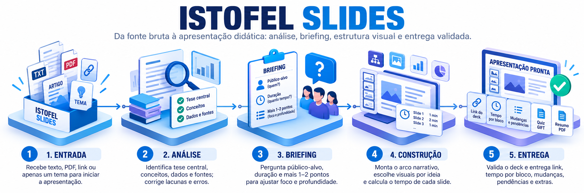

<p align="center">
    
</p>

<hr/>

# Istofel Slides

Skill para o Claude que transforma **tutoriais, artigos, PDFs, links ou apenas um tema** em uma **apresentação didática completa em português (pt-BR)**, pronta para aula, seminário ou palestra.

O deck sai minimalista e visual (diagramas, números grandes, fluxos, ícones), com **notas do apresentador e tempo de fala em todos os slides**, e pode ser editado, apresentado e exportado para PPTX ou PDF.

---

## O que a skill faz

1. **Lê a fonte**: texto colado, PDF, link ou só um tema (neste caso, pesquisa antes).
2. **Analisa o conteúdo criticamente**:
   - identifica a tese central, os conceitos e os dados com suas fontes;
   - encontra lacunas para o público e corrige erros ou traduções equivocadas.
3. **Faz um briefing de 3–4 perguntas** antes de montar qualquer coisa:
   - sempre pergunta o **público-alvo** e a **duração**;
   - acrescenta 1–2 perguntas específicas do material (foco, profundidade técnica, contexto da turma).
4. **Monta o arco narrativo** conforme a duração. Aulas longas ganham objetivos, pausas para discussão e checagem final.
5. **Traduz cada ideia em um visual**, usando um catálogo com mais de 20 padrões:
   - ciclo, hub, pipeline, pirâmide;
   - números grandes, tabela, linha do tempo;
   - bloco de código, entre outros.
6. **Calcula o tempo de cada slide pelo assunto** (um diagrama de conceito novo leva mais que uma estatística). A soma bate com a duração informada.
7. **Valida os slides** com um script antes de publicar (fonte mínima, elementos, ícones, estouro de título).
8. **Entrega** o link do deck, o tempo por bloco, o que mudou em relação à fonte e o que falta preencher.
9. **Oferece extras**: um **quiz GIFT para o Moodle** ou um **resumo de uma página** em PDF para os participantes.

---

## Requisitos

- **Claude.ai** (web, desktop ou app) com **execução de código e criação de arquivos** ativada.
  - A skill publica o deck como artefato do tipo **Slides**.
  - Se esse tipo não estiver disponível, ela gera um `.pptx` (skill `pptx`) ou uma página HTML de slides.
- Opcional: a skill `moodle-gift`, para quizzes mais completos. Sem ela, a skill usa sua própria referência de GIFT.

---

## Instalação

### Claude.ai (Free, Pro, Max)

1. Ative **Execução de código e criação de arquivos** nas configurações da conta.
2. Compacte a pasta `istofel-slides/` em `.zip`, ou use o arquivo `istofel-slides.skill` (que já é um zip).
3. Vá em **Customize > Skills**, faça o upload do arquivo e deixe a skill ativada.

Em planos Team/Enterprise, o administrador precisa permitir skills criadas por usuários em *Organization settings > Plugins & skills*.

Guia oficial: https://support.claude.com/en/articles/12512180-use-skills-in-claude

### Claude Code

```bash
git clone https://github.com/<seu-usuario>/<este-repositorio>.git
mkdir -p ~/.claude/skills
cp -r <este-repositorio>/istofel-slides ~/.claude/skills/
```

Reinicie a sessão do Claude Code. No Claude Code, o deck sai como `.pptx` ou HTML, pois o tipo Slides é recurso do Claude.ai.

---

## Como usar

Envie o material e peça a apresentação. Não é preciso citar o nome da skill:

- *"Transforma este tutorial em uma apresentação para o meu seminário."* (com o texto anexado)
- *"Prepara uma aula sobre normalização de banco de dados a partir deste PDF."*
- *"Tenho estas ideias de slides, melhora e monta a apresentação."* (com um roteiro colado)
- *"Faz uma apresentação sobre índices no PostgreSQL."* (só o tema)

A skill vai:

1. Resumir em 1–2 linhas o que entendeu do material.
2. Fazer as perguntas do briefing (em botões, quando disponível).
3. Montar e publicar o deck.
4. Terminar perguntando se você quer o **quiz GIFT** ou o **resumo de uma página**. Se aceitar, recebe só o arquivo.

Para ajustar depois: *"troca o slide 5 por uma tabela"*, *"reduz para 20 minutos"*, *"usa a paleta acadêmica"*. Só os slides pedidos são alterados.

---

## Exemplo

**Entrada:** o artigo em inglês *"AI Agents Are Changing AI Jobs"*.

**Briefing:**

| Pergunta | Resposta |
|---|---|
| Público-alvo | Profissionais de TI |
| Duração | 50 min (aula completa) |
| Onde colocar mais peso | Equilíbrio entre mercado e parte técnica |

**Saída:** 23 slides, ~45,5 min de fala e ~4 min de folga para perguntas.

| Bloco | Slides | Tempo |
|---|---|---|
| Abertura | Capa, objetivos da aula | ~1,5 min |
| Contexto | Do modelo ao sistema · O que é um agente (ciclo) · O modelo é só um componente (hub) · Dados de mercado · Pausa para pensar 1 | ~11 min |
| Cinco pilares | Pirâmide de camadas · Python e engenharia · RAG (pipeline) · Tool calling na prática (código) · Ferramentas e MCP · Orquestração · Pausa 2 · Avaliação · Como testar o agente de SQL (tabela) | ~23,5 min |
| Posicionamento | Hype × sinal real · Perfil em T · Por onde começar (4 passos) · Projetos para praticar | ~6 min |
| Fechamento | Checagem (3 perguntas) · Mensagem final · Fontes | ~3,5 min |

**Na entrega, a skill também apontou:**
- uma correção na fonte: "MCP" é *Model Context Protocol*;
- os campos a preencher: `[Nome do apresentador]` e `[autor e link]`.

---

## Estrutura

```
istofel-slides/
├── SKILL.md                    # Fluxo principal (briefing → análise → deck → extras)
├── references/
│   ├── narrativa.md            # Arco, duração → nº de slides, cálculo de tempo, notas
│   ├── padroes.md              # Catálogo de padrões visuais e trechos prontos
│   ├── design.md               # Paletas, fontes, escala tipográfica, orçamento de espaço
│   ├── pipeline.md             # Construção e publicação do deck
│   └── gift.md                 # Referência mínima de GIFT (Moodle)
├── scripts/
│   └── validar_deck.py         # Validador dos slides antes de publicar
└── assets/exemplo-deck/        # Deck de referência (17 slides) + slides de aula
```

### Validador

```bash
python istofel-slides/scripts/validar_deck.py <pasta-do-deck>/project
```

O script aponta **ERROS**, **AVISOS** e os lotes de publicação:
- **ERROS** (corrigir): CSS não suportado, fonte < 24px, ícone inexistente, imagem externa, `id` divergente, excesso de elementos;
- **AVISOS** (avaliar): títulos que vão quebrar em duas linhas, slides sem notas.

---

## Personalização

- **Paletas:** três prontas em `references/design.md`, escolhidas pelo tema.
  - Tech noturno: computação, IA, dados.
  - Acadêmico sóbrio: educação, pesquisa, humanas.
  - Vibrante: introdutório, eventos.
- **Design system:** se você tiver um no Claude, ele substitui a paleta automaticamente.
- **Apresentador:** a capa sai com `[Nome do apresentador]` para você preencher.

---

## Licença

Distribuída sob a licença [MIT](LICENSE). © 2026 Vinícius Istofel Oliveira.
